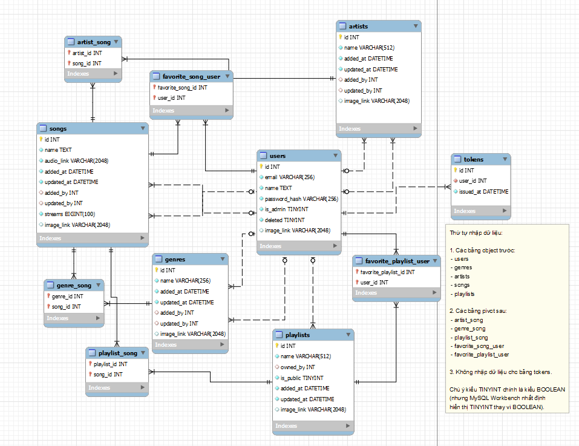

# Rhyme

Rhyme is a music web app featuring basic functionality.

This is a team project.

## Who we are

At the time of initiating this project, we are all students at
**University of Engineering and Technology (UET)**, which is a
member of **Vietnam National University (VNU)** in Hanoi. Our team:

| Student ID |     Full Name     |          GitHub Profile         |
| :--------: | ----------------- | ------------------------------- |
|  22028235  | Vũ Tùng Lâm       | <https://github.com/laam-egg>   |
|  22028286  | Nguyễn Hữu Phương | <https://github.com/png261>     |
|  22028213  | Đỗ Thái Sơn       | <https://github.com/tsun165>    |

## Introduction

Databases are the general means of storing data in large-scale applications
as well as small- and medium-sized ones. In the **Database course (INT2211E-25)**
at UET-VNU, we are taught the importance roles of databases and how to take
advantage of them. To acquire a better understanding of databases and their
applications, we together formed a team to make this web app, **Rhyme**, which
is a music web service with basic functionality, using a **MySQL database**
under the hood.

This repository holds the backend of the app. The frontend is housed at:
<https://github.com/rhyme-music-app/rhyme-frontend>

## Features

🔐 Authentication.

🎵 Music Player.

🔍 Search Songs.

❤️  Like Songs.

🎶 Create Playlists.

➕ Add Songs to Playlists.

💻 Fully responsive.

## Database Schema

## Technologies

Rhyme API is based on Symfony PHP Framework.

It also uses other libraries present in the file
[`composer.json`](/composer.json).

## How to Run

Open the file [`docs/CONTRIBUTING.md`](/docs/CONTRIBUTING.md) for details.

## API Documentation

API documentation is present in the file [`docs/API.md`](/docs/API.md).

## License

Copyright (C) 2023-now Vũ Tùng Lâm, Nguyễn Hữu Phương and Đỗ Thái Sơn.

This app is licensed under the **3-clause BSD license**. Refer to the
[`LICENSE.md`](/LICENSE.md) file for details.
